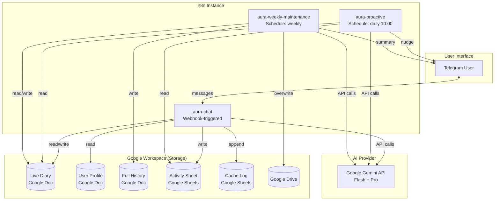
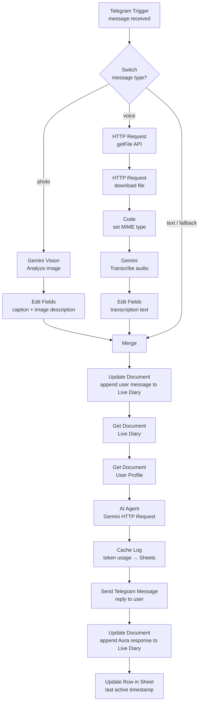
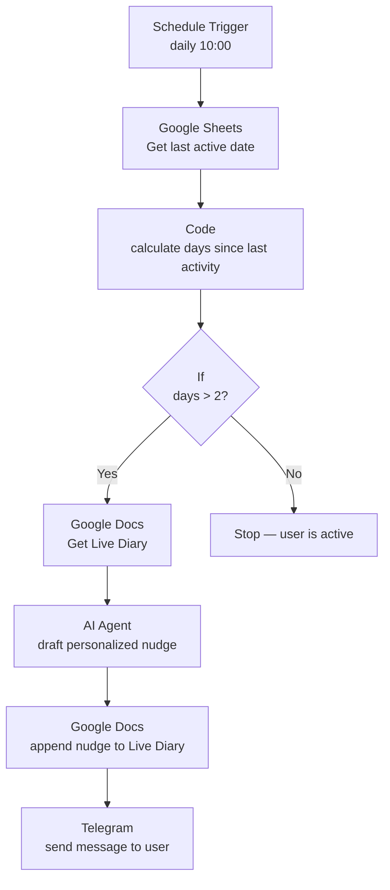
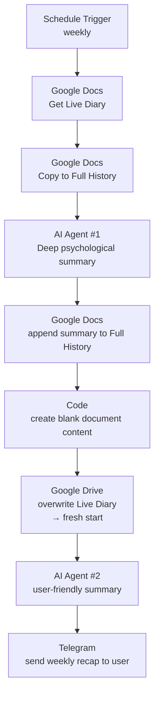

# Architecture — Aura AI Coach

## System Overview

Aura is composed of **3 independent n8n workflows** that coordinate through shared Google documents. There is no central server or database — the documents themselves serve as the integration layer.



---

## Workflow 1: aura-chat (Main Chat)

**Trigger:** Telegram Webhook (incoming message)
**Status:** Always active

### Node-by-node flow



### Key details

| Node | Purpose | Notes |
|---|---|---|
| **Switch** | Routes by message type | Photo (file_id not empty) → vision branch; Voice (file_id not empty) → transcription branch; Text → fallback |
| **Gemini Vision** | Image analysis | Prompt: "You are my eyes..." — describes image content in detail |
| **HTTP Request chain** | Voice message download | Calls Telegram `getFile` API, then downloads the `.oga` file |
| **Code (MIME fix)** | Fixes audio MIME type | Telegram sends voice as `audio/ogg`; explicitly sets before sending to Gemini |
| **Gemini Transcribe** | Speech-to-text | Uses Gemini's multimodal capability (no separate Whisper API needed) |
| **Merge** | Combines all input paths | 3 inputs: image+caption, transcribed voice, plain text |
| **AI Agent** | Core LLM call | Direct HTTP to Gemini API with full system prompt + diary + profile + user message. Supports `pro:` prefix for model switching |
| **Cache Log** | Token usage tracking | Records timestamp, model, tokens, and cache hit/miss to Google Sheets |
| **Activity Sheet** | Last active date | Updates a row so the proactive workflow knows when the user last interacted |

### Model selection

The AI Agent node dynamically selects the Gemini model based on a user prefix:

- **`pro: Hey, let's talk about my career...`** → `gemini-2.5-pro` (deeper reasoning)
- **No prefix** → `gemini-2.5-flash` (faster, cheaper)

This is implemented in the `jsonBody` expression:
```javascript
$('Merge').item.json.final_text.toLowerCase().startsWith('pro:') 
  ? 'gemini-2.5-pro' 
  : 'gemini-2.5-flash'
```

---

## Workflow 2: aura-proactive (Daily Check-in)

**Trigger:** Schedule (daily at 10:00)
**Status:** Active, scheduled

### Node-by-node flow



### Key details

| Node | Purpose | Notes |
|---|---|---|
| **Schedule** | Daily trigger | Runs every day at 10:00 (configurable) |
| **Get last active** | Activity check | Reads the "Last active date" from the Activity Sheet |
| **Code** | Day calculation | Computes `(now - lastActive) / (1000 * 60 * 60 * 24)`. Handles empty cells (never active → force trigger) |
| **If** | Threshold gate | Only proceeds if `differenceInDays > 2` |
| **AI Agent** | Nudge generation | Reads the Live Diary, identifies the most relevant unresolved topic, drafts a 2-3 sentence check-in |
| **Telegram** | Delivery | Sends the drafted message to the user's chat ID |

### Nudge philosophy

The proactive prompt is carefully designed to:
- **Never guilt-trip** (no "You haven't written in a while")
- **Be specific** (references an actual topic from the last conversation)
- **Stay casual** (friendly, not clinical)

---

## Workflow 3: aura-weekly-maintenance (Weekly Summary)

**Trigger:** Schedule (weekly)
**Status:** Active, scheduled

### Node-by-node flow



### Key details

| Node | Purpose | Notes |
|---|---|---|
| **Copy to Full History** | Archive | Appends the raw diary to a separate "full history" doc before processing |
| **AI Agent #1** | Deep summary | Creates a detailed psychological narrative (20-30% of original volume). 3rd person, analytical, preserves key metaphors and emotional patterns |
| **Code** | Fresh document | Creates a minimal Google Doc content blob (`-`) to reset the diary |
| **Google Drive** | Overwrite diary | Uses Drive API to replace the Live Diary content, effectively wiping it for the new week |
| **AI Agent #2** | User summary | Creates a friendly, concise Telegram message highlighting key themes, wins, and next steps |
| **Telegram** | Delivery | Sends the user-friendly summary to the chat |

### Why two AI passes?

1. **Pass 1 (Deep summary):** Detailed, therapeutic-grade narrative for long-term memory. Too long and clinical for a Telegram message.
2. **Pass 2 (User summary):** Friendly, concise, formatted for Telegram (plain text, bold via `<b>` tags). Designed to be read in 2-3 minutes.

### Why weekly rotation? (Token economics)

The core purpose of the weekly maintenance workflow is **cost control**. Without it:

- The Master Diary would grow by ~2,000-5,000 tokens per day
- After one month, every API call would include ~60,000-150,000 tokens of history
- Gemini Flash pricing: $0.075/million input tokens → a single message could cost $0.01 instead of $0.001
- After 6 months, costs would be unsustainable

The rotation strategy keeps per-message costs **flat and predictable** regardless of how long Aura has been running.

---

## Cost Efficiency & Gemini Context Caching

Aura's prompt architecture is designed to maximize **Gemini's automatic context caching**, which gives ~90% discount on repeated prompt prefixes.

### How caching works in Aura

The prompt sent to Gemini on every message has this structure:

```
┌──────────────────────────────────┐
│ SYSTEM INSTRUCTION (persona,      │
│ rules, tone, protocol)           │  ← STATIC → Cached after first call
│ ~2,000 tokens                    │     90% discount on all subsequent calls
├──────────────────────────────────┤
│ USER PROFILE (goals, patterns)   │  ← RARELY CHANGES → Cached most of the time
│ ~500 tokens                      │
├──────────────────────────────────┤
│ MASTER DIARY (conversation log)   │  ← DYNAMIC → Full price, but kept small
│ ~1,000-3,000 tokens              │     via weekly rotation
├──────────────────────────────────┤
│ LATEST USER MESSAGE              │  ← DYNAMIC → Full price (small)
│ ~50-200 tokens                   │
└──────────────────────────────────┘
OUTPUT: Aura's response (~200-500 tokens, standard output pricing)
```

**Key design decisions for caching:**

1. **System prompt comes first** — Gemini caches from the start of the input. By putting the longest static content at the beginning, we maximize the cacheable prefix.
2. **User profile is stable** — written once, rarely edited. Stays cached between sessions.
3. **Master Diary is the only growing element** — and it's reset weekly to prevent cache boundary creep.
4. **Cache hit/miss is tracked** — the Cache Log Google Sheet records every API call with token breakdowns, making caching efficiency measurable.

### Typical costs

| Usage pattern | Messages/day | Est. monthly cost |
|---|---|---|
| Light (3-5 messages) | ~120 | ~$0.10 |
| Moderate (10-15 messages) | ~400 | ~$0.30 |
| Heavy (30+ messages) | ~1,000 | ~$0.75 |

> 💡 Context caching makes the system prompt effectively free after the first message of a session. Only conversation history and response generation incur meaningful costs.

---

## Data Model

### Google Docs

| Document | Purpose | Read by | Written by |
|---|---|---|---|
| **Live Diary** | Recent conversation history (current week) | All workflows | aura-chat, aura-proactive, aura-weekly |
| **User Profile** | Persistent user facts & preferences | aura-chat | (manual setup) |
| **Full History** | Long-term archive of all summaries | (future reference) | aura-weekly |

### Google Sheets

| Sheet | Columns | Purpose |
|---|---|---|
| **Activity Sheet** | `Last active date`, `row_number` | Tracks when the user last interacted. Checked daily by proactive workflow. |
| **Cache Log** | `Timestamp`, `Model`, `Total Tokens`, `Cached tokens`, `HIT / MISS` | API usage analytics. Tracks Gemini context caching efficiency. |

---

## Error Handling & Resilience

- **Telegram send failures:** The `Send a text message` nodes have `onError: continueRegularOutput` — if a message fails to send (e.g., user blocked the bot), the workflow continues without breaking.
- **Retry on fail:** Critical nodes have `retryOnFail: true` enabled.
- **Google Docs "Copy history" node:** Uses `onError: continueRegularOutput` to prevent the weekly maintenance from failing if the copy step encounters an issue.
- **No dead letter queue:** As a personal bot, failed interactions are visible in n8n's execution log for manual review.

---

## Security

- **Credentials:** All API keys, OAuth tokens, and the Telegram bot token are stored in n8n's encrypted credential store. They are **never exported** in workflow JSONs.
- **No external access:** All documents and sheets are in the user's personal Google Drive. No data leaves the user's Google account (except the Gemini API calls).
- **Chat ID scoping:** The Telegram chat ID is hardcoded in the workflow, preventing other users from interacting with the bot.
- **Bot token in HTTP URLs:** Two `HTTP Request` nodes for Telegram file download include the bot token in the URL. These are replaced with `YOUR_BOT_TOKEN` in the public repository.

---

## Scaling Considerations

This architecture works well for a **single user**. For multi-user scenarios:

- Replace Google Docs with a proper database (PostgreSQL, MongoDB)
- Add user authentication and session management
- Replace hardcoded chat IDs with a user lookup
- Consider message queuing for high throughput

The core workflow logic (message routing, AI integration, proactive scheduling) remains applicable.
